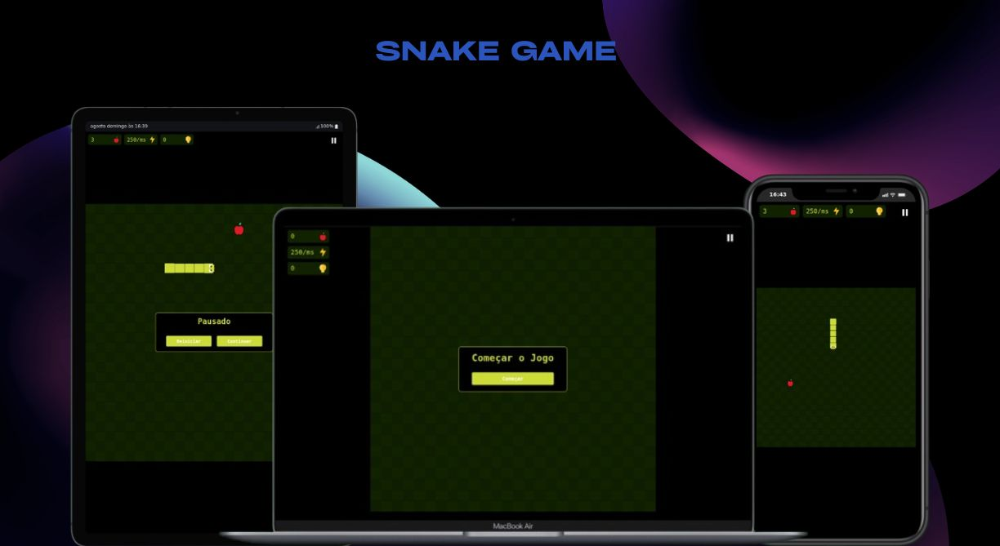

<h1 align="center">Snake Game</h1>
<div align="center">
  <a href="#descrição">Descrição</a> |
  <a href="#iniciar">Iniciar</a> |
  <a href="#licença">Licença</a>
</div>

<p align="center">
  
</p>
<p>
 
</p>

## Descrição

O site é uma aplicação web interativa que recria o clássico Snake Game (o famoso "jogo da cobrinha"). Sendo essa uma aplicação compatível tanto em ambiente desktop quanto mobile.

controles

- mover: a,w,d,s, as flechas direcionais ou touch screen(mobile).
- pausar/des-pausar: Esc ou Espaço

As principais funções do site são:

- função de pausar.
- função de reiniciar.
- Ao se tocar é game over.
- Contadores de pontas feito e registro de maior pontuação
- A dificuldade do jogo aumenta, de acordo com a quantidade de pontos alcançados.

Acesse o site **[Snake Game](https://matheus369k.github.io/snake-game/)**.

## Iniciar

E Necessário ter o Nodejs, o git instalado, agora siga os passo para inicia-lo.

Faça clone do repositório localmente.

```bash
git clone https://github.com/matheus369k/snake-game.git
cd ./snake-game
```

Instale as dependencies

```bash
pnpm install
```

Agora você pode iniciar o projetos

```bash
pnpm dev
```

## Licença

Licença usada **[MIT](./LICENSE.txt)**
